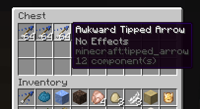
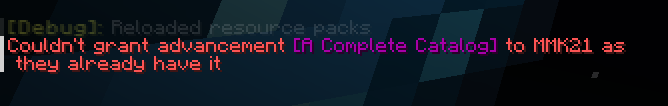
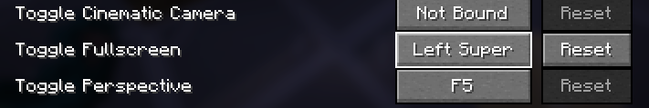
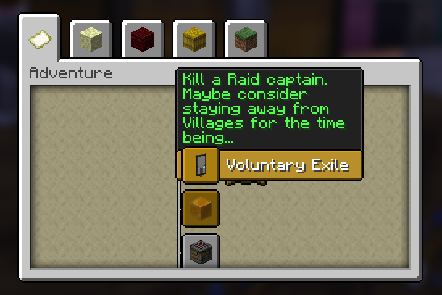
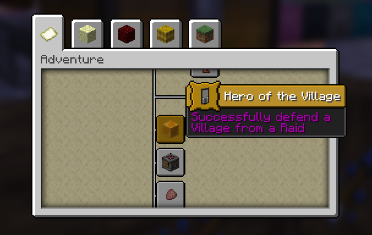

# Capitalisation Fixes v2.20 changelog

It's been a year since the resource pack was last updated, and even longer than that since the last release with new fixes, but this release is here to being the pack back up to speed with the latest Minecraft versions, and it also comes with 4 new bugfixes and 19 new translation strings!

## New bugfixes

### [MC-158539](https://bugs.mojang.com/browse/MC/issues/MC-158539) Awkward/Thick/Mundane Tipped Arrows use a generic name

You can now distinguish between tipped arrows made with awkward, thick, or mundane potions! Previously, they were all simply called "Tipped Arrow", which is a bit confusing.

### [MC-250194](https://bugs.mojang.com/browse/MC/issues/MC-250194) The word "Catalogue" within the "A Complete Catalogue" advancement isn't spelled in American English

This one only affects players who use the English (United States) language, but if you do, you'll notice that the word "Catalogue" actually uses its British spelling. No more!

### [MC-189953](https://bugs.mojang.com/browse/MC/issues/MC-189953) Controls menu calls Super key "Win"

When you're customising your controls in Minecraft, you can bind the Windows logo key. But on non-Windows platforms, it doesn't make sense to call it the Windows key (macOS calls it the Command key, and Linux usually calls it the Super key). Its generic name is the Super key, so that's now what it shows up as in the Key Binds menu. It's now correct on all platforms, with the drawback that it's a bit less intuitive for most users.

### [MC-250153](https://bugs.mojang.com/browse/MC/issues/MC-250153) Some advancement description strings are improperly capitalized

Going back to the pack's roots with this one! Some of the descriptions for Minecraft's various advancements don't capitalise words where they should be capitalised. 13 advancement descriptions have been fixed in this release!

## Additions to existing bugfixes

- [MC-256422](https://bugs.mojang.com/browse/MC/issues/MC-256422) was fixed by Mojang in 24w33a (for release 1.21.2), but if you're using the pack in an older version, it now fixes apostrophe characters in two more translation strings

## Removed bugfixes

Two bugs have been fixed by Mojang, so are no longer present in the pack (when built for the latest Minecraft version). However, they are still present in any pack variants that target older versions.

- [Strings that use the right-quote-mark character](https://bugs.mojang.com/browse/MC-256422) Fixed in 24w33a
- ["Buffet world customization" title](https://bugs.mojang.com/browse/MC-222876) Fixed in 25w02a

## Technical improvements

- Mojira has migrated to Jira Cloud, so the build tool now uses the `bugs-legacy.mojang.com` domain so that it can keep working using the old API. At some point, I may need to migrate it to use the new Jira Cloud platform, but I have found that the old API still works as expected.
- The `CapitaliseFromTranslationStringsTransformer` transformer used to capitalise words it found in the middle of other words, so it could generate a string like "successFull". This has now been fixed.
- All dependencies for the build tool have been updated (including Node.js and Yarn) to help keep it stable and secure.

## Known issues with the build tool

Sometimes the build tool crashes when attempting to fetch the version manifest at <https://launchermeta.mojang.com/mc/game/version_manifest_v2.json>, printing a `FetchError` and long stack trace. This is a temperamental fault, so can be worked around by re-running the build tool until it works.
